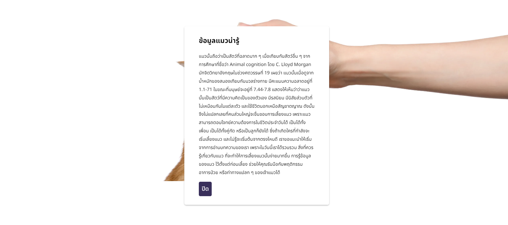

# Modal-Popup
This code sets up a modal (pop-up window) on your website, featuring an "Open" button and a "Close" button, along with variables used to interact with HTML elements using JavaScript:

1. Element Access:

openBtn: Represents a button that triggers the display of the modal when clicked.
closeBtn: Corresponds to a button located within the modal; clicking it hides the modal.
modalContainer: A variable facilitating access to the modal elements.

2. Event Listeners:
 
 2.1 openBtn.addEventListener("click", () => {...}): Listens for a click on the "Open" button. Upon click, it adds a "show" class to modalContainer, triggering the display of the modal.
 
 2.2  closeBtn.addEventListener("click", () => {...}): Listens for a click on the "Close" button within the modal. When clicked, it removes the "show" class from modalContainer, causing the modal to disappear.

In summary, clicking the "Open" button reveals the modal, and clicking the "Close" button inside the modal hides it. This coding pattern is commonly employed in web development for modal implementations.

Links Solution URL: [https://github.com/hedisnice/Modal-Popup]

Live Site URL: [https://hedisnice.github.io/Modal-Popup/]

